# Whitespace Mapping AI Agent

**Stop guessing where the whitespace is — let an agent read the signals and show its work.**

---

## The problem

Whitespace Mapping — knowing which Buying Centers (IT, Procurement, Finance, Operations, Marketing, Security…)
already use which of your Solutions, and where the unaddressed opportunity sits — is one of the highest-leverage
artifacts in account planning. In practice, most teams maintain it by hand:

- A rep manually cross-references CRM opportunities, call notes, and org charts once a quarter (if that).
- Signals that actually indicate whitespace or risk — a hiring spike, an RFP, a tech-stack change, a throwaway
  line in a call transcript — never make it into the account plan at all.
- The matrix goes stale between QBRs, so reps walk into renewal and expansion conversations guessing at coverage.
- When something *does* get updated, there's no record of why — no confidence, no source, no audit trail — so
  the next rep who inherits the account can't trust it either.

The result: missed upsell motions, account plans nobody believes, and forecast conversations built on stale
reads of the account.

## What this does

The Whitespace Mapping AI Agent continuously **analyzes** signals from CRM records, call transcripts, org charts,
intent data, and firmographics for an account; **validates** what they imply about each Buying Center × Solution
cell against what's already on record; and **proposes updates** to the matrix — each one staged with a confidence
score, a plain-language rationale, and a citation back to the exact source it came from. Nothing is written to the
account plan automatically. A human reviewer approves, edits, rejects, or comments on every suggestion, and when
two signals disagree (e.g. CRM shows a renewal, a call transcript hints at churn), the agent flags it as a
**conflict** instead of silently picking a side.

## Key features

- **Buying Centers × Solutions heatmap matrix** — status, estimated ARR, and a value bar per cell, with an
  account-context header (segment, tier, total ARR, renewal date).
- **Staged AI suggestions, never auto-applied** — every proposed change appears as a dashed, pulsing cell plus an
  entry in the Review Queue, with confidence %, source/provenance, and rationale always visible.
- **Conflict detection** — contradictory signals (e.g. "Closed Won" in CRM vs. churn risk in a call transcript)
  are visually and structurally distinct from ordinary suggestions, and are never auto-resolved.
- **Reviewer actions** — Approve, Reject, Edit-before-applying, and Comment on every suggestion, plus bulk-approve
  above a confidence threshold.
- **Before/After diff** on every suggestion and conflict.
- **Cell drill-down** — history, related contacts, notes, linked opportunities, and the AI's reasoning for any
  cell.
- **Data Ingestion panel** — every source family the agent reads from, with sync status, last-updated time,
  record counts, sample fields, and an "AI-derived" badge on lower-confidence unstructured sources.
- **Activity/Audit log** — a full timeline of what the agent analyzed, what it proposed, and what a reviewer
  approved/rejected/commented on.
- **Scenario mode** — "what if we win Solution X in Buying Center Y?" preview of the coverage/whitespace delta.
- **Coverage summary stats** — whitespace mapped %, won coverage %, pending reviews, conflicts, at a glance.
- **Export for QBR** — one-click Markdown export of the current matrix and coverage stats.
- **Filters** — by region, solution line, and buying center.

## Screenshots


*(Placeholders — drop real captures into `/screenshots` before the demo.)*

## Tech stack

- [React 18](https://react.dev/) (functional components + hooks) via [Vite](https://vitejs.dev/)
- [Tailwind CSS](https://tailwindcss.com/) utility classes
- [lucide-react](https://lucide.dev/) icons
- Plain JSON/JS mock data (`/src/data`) — no backend, no state library beyond React state

## Architecture overview

```mermaid
flowchart LR
    subgraph Sources["Data Sources (see table below)"]
        CRM["CRM: Account, Buying Center,\nOpportunity, Product Catalog"]
        Unstructured["Unstructured / AI-derived:\nContracts, Tech Stack, Intent, Firmographics"]
        Usage["Product Usage · Org Charts"]
    end

    Sources -->|ingested & synced| Ingestion["Data Ingestion Panel\n(sync status, record counts, provenance)"]
    Ingestion --> Agent["Whitespace Agent\nanalyze → cross-check → score confidence"]
    Agent -->|staged, never auto-applied| Staged["Staged Suggestions & Conflicts\n(dashed cell + Review Queue entry)"]
    Staged --> Review["Human Review\nApprove / Reject / Edit / Comment"]
    Review -->|approved| Matrix["Whitespace Matrix\n(Buying Centers x Solutions)"]
    Review -->|logged either way| Audit["Activity / Audit Log"]
    Matrix --> Audit
```



## How it works (user flow)

1. **Sync a source** — open **Data Sources**, review connected feeds (or upload a new file / hit Re-sync on a
   stale one).
2. **Agent proposes** — the agent panel on the right narrates what it analyzed and what it's proposing; matching
   cells on the matrix get a dashed, pulsing "pending" treatment.
3. **Reviewer decides** — open the **Review Queue** (or click the cell directly) to see the before/after diff,
   confidence, source, and rationale, then Approve, Reject, Edit, or Comment. Conflicts are called out separately
   and require a decision, not a guess.
4. **Matrix updates** — an approved suggestion applies immediately and the pending styling clears.
5. **Audit log records it** — every analysis, proposal, approval, rejection, and comment is timestamped with the
   reviewer's name in the **Audit Log** tab.

## Getting started

```bash
git clone <this-repo>
cd hackathon-whitespace-ai-agent
npm install
npm run dev      # starts the Vite dev server, prints a local URL
```

```bash
npm run build    # production build to /dist
npm run preview  # preview the production build locally
```

## Demo instructions — the wow moment

1. Land on the **Matrix** tab — notice the dashed, pulsing cells (AI suggestions) and the one with a rose dashed
   ring (a flagged **conflict**) in the Finance row.
2. Click **Review Queue** in the tab bar (badge shows the combined pending count) — the two **Conflicts** are
   listed first, each showing exactly which source contradicts the confirmed CRM record.
3. Click **Approve**, **Reject**, or **Edit** on any suggestion and watch the matrix cell update live, the
   coverage stats in the header recalculate, and a new line appear in the **Audit Log**.
4. Try the **Scenario** bar above the matrix — pick a whitespace cell and preview the coverage-% lift from
   "winning" it.
5. Ask the agent panel a question like *"what conflicts do we have?"* or *"how confident are we on Procurement?"*

## Data sources

The agent is designed against these source families (structured around what a real Account Planning stack would
expose). The Data Ingestion panel and every suggestion's provenance tag reference this schema directly:

| Source Family | Minimum Recommended Fields |
| --- | --- |
| CRM Account (input account) | `account_id`, `parent_account_id`, `account_name`, `website_domain`, `HQ_country`, `segment`, `territory`, `owner`, `install_base`, `competitor_flags` |
| CRM Contact/Relationship (Buying Center master) | `buying_center_id`, `account_id`, `buying_center_name`, `description`, `geography`, `budget_owner_id`, `buying_potential` |
| CRM Opportunity (Initiatives) | `initiative_id`, `initiative_name`, `description`, `rec` (recommendation), `citations` |
| CRM Product Catalog (Solutions) | `solution_id`, `solution_name`, `parent_solution_id`, `description`, `associated_products`, `is_parent` |
| Contracts | sourced via LLM web search |
| Product Usage | `customer_solved_challenges` |
| Org Charts / People | org chart and executive contacts table |
| Tech Stack | current tools, new tech stack, adjacent tech stack |
| Intent / Web Behavior | intent table (from an intent `.txt` file feed) |
| Firmographics | industry, employee count, revenue, geography, growth rate, renewals, RFPs, funding rounds, acquisitions, partnerships, analyst mentions, hiring spikes |

## What's mocked vs. real

This is a hackathon build — **all analysis and "AI" behavior is simulated with static mock data and canned
logic**, structured so it can be swapped for a real backend without touching component code:

- **Mock**: every file in `/src/data` (account, buying centers, solutions, initiatives, contracts, usage, org
  chart, tech stack, intent, firmographics, matrix cells, suggestions, conflicts, audit log, agent narration).
  Confidence scores, rationale text, and provenance tags are hand-authored, not model-generated.
  The agent chat panel replies with simple keyword-matched canned responses, not a real LLM call.
- **Real**: React state management, the approve/reject/edit/comment/bulk-approve logic, the before/after diff and
  coverage-stat math, the scenario preview calculation, and the Markdown export (actually generates and downloads
  a file from live app state).
- **A production version would connect to**: a real CRM API (Salesforce/HubSpot/etc.) for the four CRM source
  families, an LLM backend (e.g. Claude) for transcript/document analysis and suggestion generation, an org-chart
  parser/HRIS integration, a web-search or firmographic-data provider (e.g. Clearbit, ZoomInfo) for Contracts and
  Firmographics, and a persistence layer for the audit log and review decisions.

Every place in the code where mock logic stands in for a real integration is marked with an inline comment
(search for `Source family:` in `/src/data` and `real API call` in the components).

## Future roadmap

- Real LLM integration for transcript/document analysis and suggestion generation (replacing canned rationale
  text with actual model output, grounded in retrieved source documents).
- Slack/CRM notifications when a new conflict or high-confidence suggestion is staged.
- Multi-account rollups and portfolio-level whitespace dashboards for managers.
- Role-based permissions (who can approve vs. only comment; per-region reviewer ownership).
- Persisted review history and versioned account plans instead of in-memory React state.

## Team

- _Add your name(s) and role(s) here._

## License

MIT (placeholder — update if the team wants a different license for submission).
